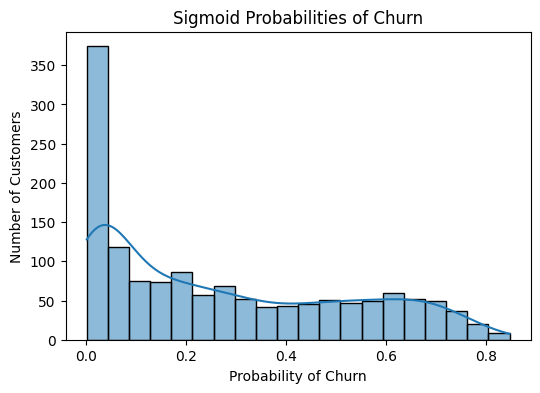
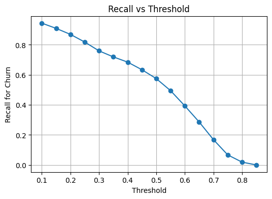
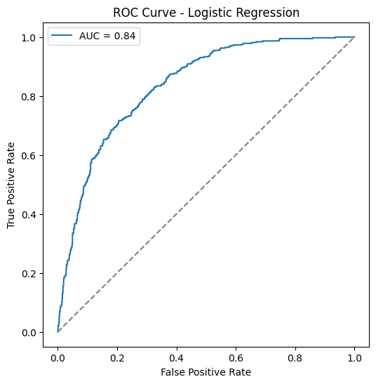

# Customer Churn Prediction

## 📌 Overview
This project predicts customer churn using **Logistic Regression**.  
The goal is to identify customers who are likely to leave a telecom company, enabling targeted retention strategies.  
The model uses **sigmoid probabilities** and **threshold tuning** to optimize recall for churn customers.

---

## 📊 Dataset
- Source: `/data/Churn.csv`
- Features: mix of numeric and categorical (converted to 0/1)
- Target: `Churn` (Yes/No → 1/0)
- Dataset split: 80% train / 20% test

---

## 🔧 Methodology

1. **Data Preprocessing**
   - Encode categorical variables (`Yes`/`No`, `Gender`) to 0/1
   - Handle missing values (if any)
   - Split into train/test sets

2. **Exploratory Data Analysis (EDA)**
   - Visualize numerical distributions
   - Analyze churn distribution
   - Correlation heatmap for numeric features

3. **Logistic Regression Model**
   - Trained on processed data
   - Outputs **sigmoid probabilities** for churn

4. **Threshold Tuning**
   - Default threshold = 0.5
   - Tested 0.4 and 0.3
   - Optimal threshold = 0.4 (highest F1-score for churn)
   
5. **Evaluation**
   - Classification report (precision, recall, F1-score)
   - ROC curve & AUC
   - Recall vs threshold plot
   - Probability histogram

6. **Deployment**
   - Model saved as `logistic_churn_model.pkl` using `joblib`
   - Ready for integration in web apps or dashboards

---

## 📈 Results

| Threshold | Accuracy | Precision (Churn) | Recall (Churn) | F1-score (Churn) |
|-----------|----------|------------------|----------------|-----------------|
| 0.5       | 0.80     | 0.65             | 0.57           | 0.61            |
| 0.4       | 0.78     | 0.58             | 0.68           | 0.63 ✅         |
| 0.3       | 0.74     | 0.51             | 0.76           | 0.61            |

> Threshold 0.4 selected as the **best trade-off** between recall and precision for churn detection.

---

## 📊 Visualizations

1. **Probability Histogram**
   

2. **Recall vs Threshold**
   

3. **ROC Curve**
   

---

## 💡 Feature Insights
- Logistic Regression coefficients indicate which features contribute most to churn
- Example: higher monthly charges or lower tenure may increase churn probability

---

## 🚀 Usage Instructions

1. Clone the repository
```bash
git clone https://github.com/Abre1234/Customer_Churn_Prediction.git
cd Customer_Churn_Prediction
